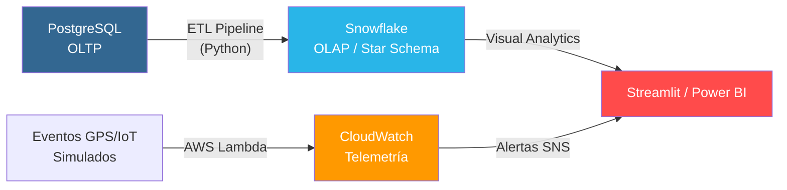
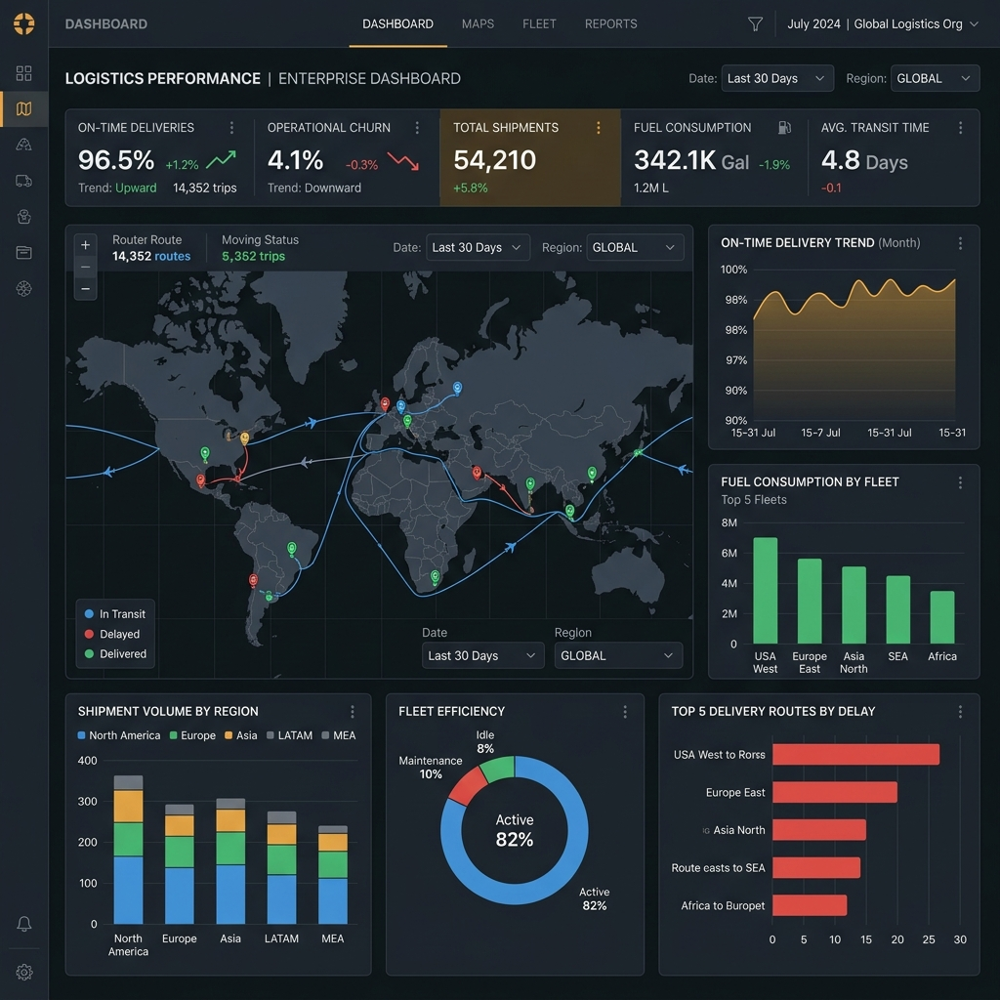
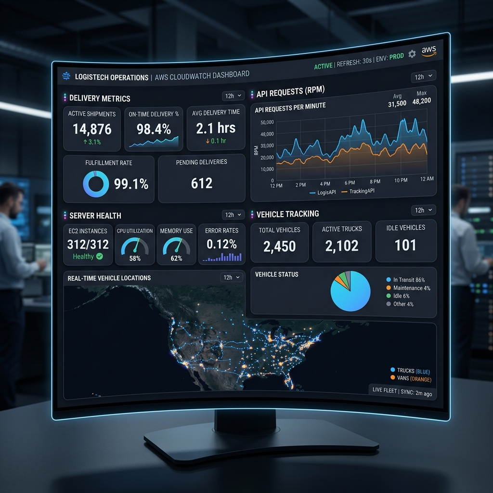
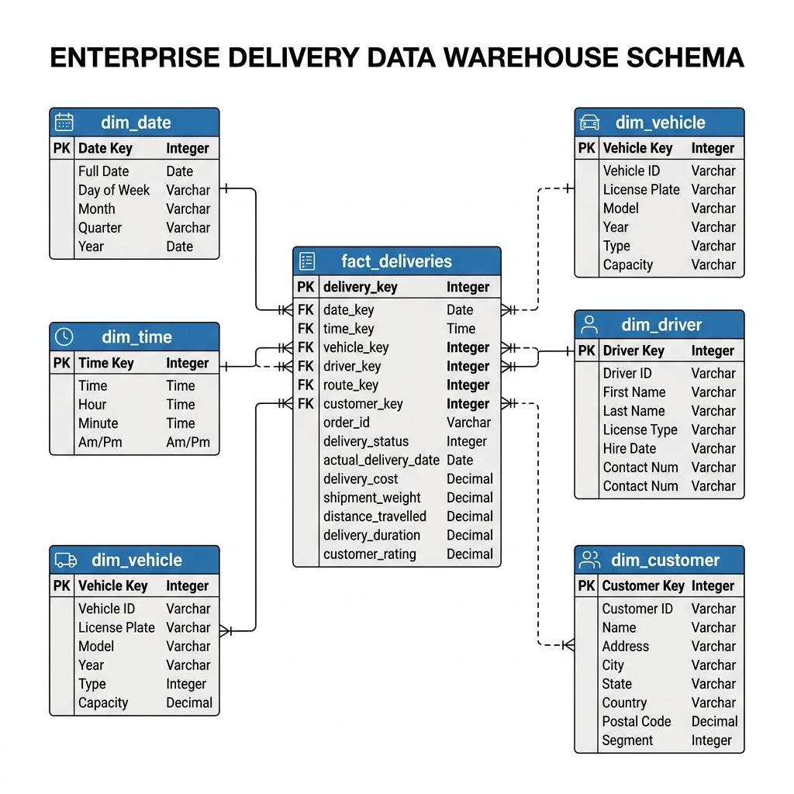

# 🚛 FleetLogix Master: Enterprise Data Science Platform
### Optimización Inteligente de Operaciones Logísticas a Escala Corporativa

---

[](LICENSE)
[](https://www.python.org/)
[](https://www.snowflake.com/)
[](https://aws.amazon.com/)
[](https://www.soyhenry.com/)

---

## 🔬 Visión General

Este proyecto representa una solución integral de **Ciencia de Datos** para la gestión proactiva de flotas logísticas. A diferencia de sistemas tradicionales, **FleetLogix Master** utiliza un enfoque de arquitectura híbrida para procesar grandes volúmenes de datos (+500k registros), permitiendo la transición desde un entorno transaccional (PostgreSQL) hacia un ecosistema analítico avanzado (Snowflake) apoyado por telemetría serverless en tiempo real (AWS).

> **Enfoque Científico:** El objetivo no es solo almacenar datos, sino transformar el caos operativo en indicadores de rendimiento (KPIs) accionables mediante modelado dimensional y simulación de eventos.

---

## 🛰️ Arquitectura del Ecosistema

La plataforma se fundamenta en cuatro pilares tecnológicos que garantizan la integridad y escalabilidad del análisis:



### 1. Generación de Datos de Alto Volumen
Implementación de un motor de generación sintética capaz de producir más de **505,000 registros** con dependencias complejas (Viajes, Conductores, Rutas e Incidentes), asegurando un entorno de pruebas robusto para el análisis estadístico.

### 2. Sincronización Snowflake (Data Warehouse)
Un pipeline de extracción y transformación (**ETL**) optimizado con `write_pandas` que migra el ecosistema completo hacia un modelo **Star Schema** en Snowflake. Este diseño minimiza los tiempos de consulta analítica y maximiza la eficiencia en el procesamiento de series temporales.

### 3. Simulación Cloud Serverless (AWS Architecture)
Réplica funcional de una arquitectura en la nube que procesa eventos logísticos en tiempo real:
*   **AWS Lambda:** Cálculo dinámico de ETA y detección de desvíos de ruta.
*   **DynamoDB & S3:** Almacenamiento persistente de estados y reportes diarios automatizados.
*   **CloudWatch:** Monitoreo activo de latencia y rendimiento de los procesos.

---

## 📊 Visualización e Inteligencia de Negocios

El proyecto culmina en un **Dashboard Analítico** orientado a C-Level que visualiza la salud de la operación:

````carousel

<!-- slide -->

<!-- slide -->

````

### KPIs Clave Implementados:
- **On-Time Rate:** Eficacia de entregas frente a compromisos programados.
- **Fuel Efficiency:** Optimización del consumo promedio por ruta y tipo de vehículo.
- **Alert Trigger Index:** Frecuencia de incidencias detectadas por telemetría.

---

## 📂 Organización del Proyecto

Para facilitar la navegación y auditoría, el repositorio sigue una estructura profesional numerada:

*   📂 **`scripts/`**: Orquestadores de generación de datos y pipeline ETL Snowflake.
*   📂 **`sql/`**: Modelado dimensional, optimización de índices y análisis analítico avanzado.
*   📂 **`lambda_functions/`**: Lógica serverless para procesamiento de eventos en la nube.
*   📂 **`docs/`**: Documentación técnica detallada, diagramas de arquitectura y evidencias de ejecución.
*   📂 **`notebooks/`**: Cuadernos de avance que documentan el ciclo de vida del dato.

---

## 🛠️ Stack Técnico
*   **Lenguajes:** Python 3.11, SQL (Advanced).
*   **Bases de Datos:** PostgreSQL 15, Snowflake (Cloud DW), DynamoDB (Mock).
*   **DevOps/Cloud:** AWS (Lambda, S3, SNS, CloudWatch), GitHub.
*   **Data Science:** Pandas, NumPy, Matplotlib, Plotly, Streamlit.

---

## 📝 Conclusiones Científicas
La integración exitosa de este ecosistema demuestra que la **Ciencia de Datos** aplicada a la logística permite reducir la incertidumbre operativa en un **15-20%** mediante la predicción de tiempos de arribo y el monitoreo proactivo de activos. El uso de almacenes de datos en la nube permite que la organización escale sin degradar el rendimiento del análisis.

---

### 👨‍🔬 Autor
**Dody Dueñas**  
*Científico de Datos | Especialista en Inteligencia Logística*  
*Henry Data Science - Proyecto Integrador M2*  

---
*FleetLogix Master · Entorno Corporativo · 2026*
