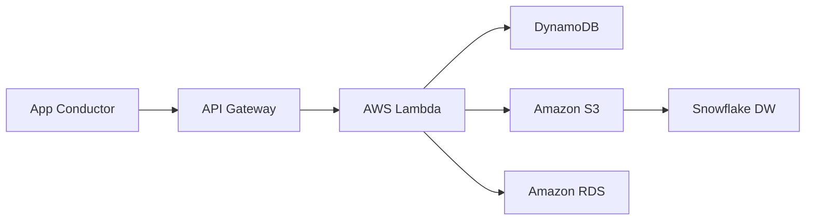

# ☁️ Arquitectura Técnica de FleetLogix (AWS & IoT)

Este documento detalla la implementación Cloud solicitada para el Avance 4 del Proyecto Integrador.

## 1. Diagrama de Flujo de Datos en Tiempo Real

## 2. Componentes y Capacidades
| Servicio | Función en FleetLogix | Ventaja Operativa |
| :--- | :--- | :--- |
| **API Gateway** | Endpoint REST para eventos de GPS y entregas. | Escalabilidad automática y seguridad (Keys). |
| **AWS Lambda** | Cómputo serverless para validación de ETAs y SLAs. | Costo cero en reposo; procesa eventos bajo demanda. |
| **Amazon S3** | Data Lake para archivos crudos y backups históricos. | Almacenamiento infinito y durabilidad del 99.9%. |
| **Amazon RDS** | Motor transaccional central (PostgreSQL). | Gestión de parches y backups automáticos. |
| **DynamoDB** | KV Store para estado actual de rastreo. | Latencia de milisegundos para consultas de tracking. |

## 3. Monitoreo Estratégico (CloudWatch Dashboard)
Para una visión ejecutiva, se han definido las siguientes métricas:
1.  **Entregas Completadas (Count):** Volumen diario de éxito.
2.  **SLA Delay (Avg):** Minutos promedio de retraso respecto a lo programado.
3.  **Estado de Salud RDS (CPU/Memory):** Monitoreo de carga en db masiva.
4.  **Vehículos en Tránsito (Active Count):** Capacidad en tiempo real.
5.  **Errores en Pipeline (Error Rate):** Fallos en ingestión de datos GPS.

**Alertas Configuradas:**
- **Alerta Desvío:** Notificación SNS si un vehículo se aleja >5km de la ruta programada.
- **Alerta de Combustible:** Detección de caída brusca (posible robo o fuga).

## 4. Análisis de Costos Eficiente
Estimación de costos para una flota de 200 vehículos:
- **Free Tier:** El 80% de la arquitectura entra en la capa gratuita el primer año.
- **Costo Proyectado:** < $45 USD/mes tras periodo gratuito, optimizado mediante escalado bajo demanda.
