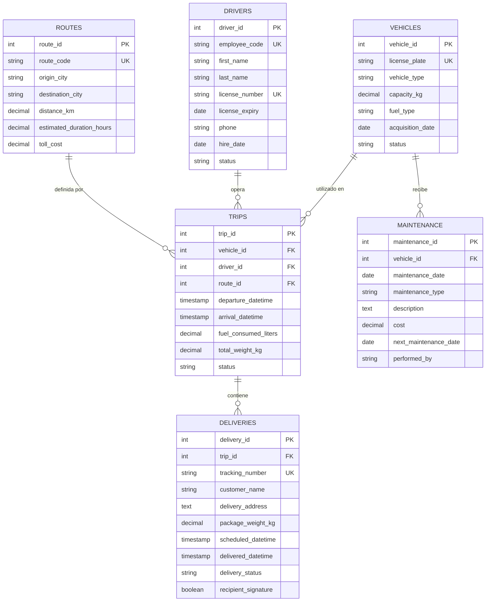

# 📊 Modelo Entidad-Relación (ER) - FleetLogix

Este diagrama representa la arquitectura relacional de la base de datos PostgreSQL, diseñada para soportar operaciones masivas de transporte y logística.

## 🔍 Análisis de Patrones de Negocio
1.  **Atomicidad de Entregas:** Una entrega no existe sin un viaje (`TRIPS`), lo que asegura la trazabilidad logística desde el origen hasta el punto final.
2.  **Optimización por Rutas:** La tabla `ROUTES` centraliza los costos fijos (peajes) y distancias, permitiendo calcular la rentabilidad proyectada antes de la ejecución del viaje.
3.  **Ciclo de Vida de Activos:** La relación `VEHICLES` -> `MAINTENANCE` permite un análisis preventivo de costos operativos vs. vida útil del vehículo.
4.  **Cumplimiento de SLA:** La marca de tiempo en `DELIVERIES` (`scheduled` vs `delivered`) es la métrica clave para el cálculo de bonificaciones a conductores y satisfacción del cliente.
